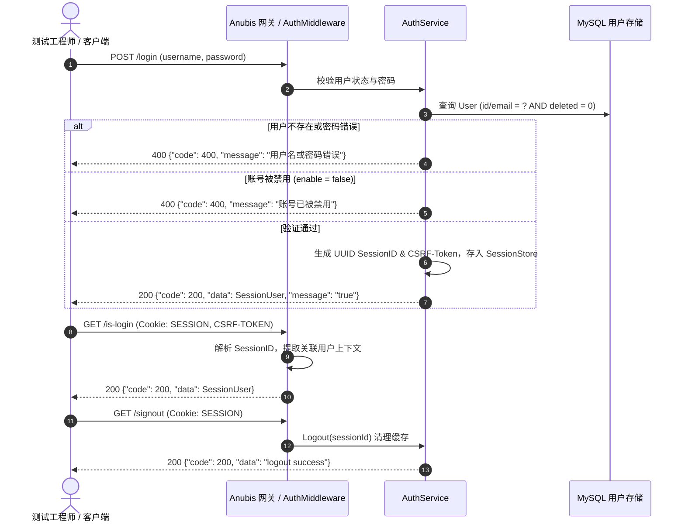

# REQ-AUTH-001: 用户认证、会话保持与凭证安全需求规格说明

## 1. 需求背景与业务定位
TrueOne 作为企业级统一质量保障与测试调度平台，后端服务 `trueone-anubis` 承载了全公司的测试资产、工作流执行与权限隔离。认证与会话系统是平台的入口防线，必须保障凭证存储安全、会话生命周期严格受控、防暴力破解与水平越权。

---

## 2. 核心业务流程与时序

---

## 3. 功能接口清单与契约规格

### 3.1 用户登录 (`POST /login` / `POST /api/login`)
- **请求格式**：`application/json`
- **请求参数**：
  | 字段名 | 类型 | 必填 | 说明 |
  | :--- | :--- | :--- | :--- |
  | `username` | string | 是 | 用户登录标识（支持用户 ID 或 注册邮箱） |
  | `password` | string | 是 | 用户密码（支持明文或客户端 MD5 摘要） |
- **预期响应**：
  - 成功：HTTP 200，返回完整的 `SessionUser` 对象（包含 `id`, `name`, `email`, `lastOrganizationId`, `lastProjectId`, `sessionId`, `csrfToken`, `userRoles`, `permissions`）。
  - 失败（密码错误）：HTTP 200 / 400，返回错误码 400 及 `用户名或密码错误`。
  - 失败（被禁用）：HTTP 400，返回 `账号已被禁用`。

### 3.2 登录状态与用户信息检查 (`GET /is-login` / `GET /api/is-login`)
- **请求凭证**：Header / Cookie 携带 `SESSION` 与 `CSRF-TOKEN`。
- **预期响应**：
  - 已登录：HTTP 200，返回当前登录用户的角色、权限清单及上次停留的组织/项目空间。
  - 未登录且无上下文：HTTP 401，返回 `未登录`。

### 3.3 退出登录 (`GET /signout` / `GET /api/signout`)
- **预期响应**：
  - HTTP 200，清除服务端会话映射，返回 `logout success`。

### 3.4 切换上下文项目 (`POST /project/switch` / `POST /api/project/switch`)
- **请求参数**：`{"projectId": "...", "userId": "..."}`
- **预期响应**：
  - 更新当前会话用户上下文中的 `lastProjectId`，防越权读取非所属组织项目。

---

## 4. 质量验收与安全红线 (Risk & Acceptance)
| 用例编号 | 风险等级 | 测试场景 | 验收准则 |
| :--- | :--- | :--- | :--- |
| `TC-AUTH-001` | **P0** | 管理员账号正确密码登录 | 必须返回 200，且颁发非空的 `sessionId` 和 `csrfToken` |
| `TC-AUTH-002` | **P0** | 错误密码尝试登录 | 必须拒绝登录，返回 `用户名或密码错误`，杜绝返回具体哪个字段不匹配 |
| `TC-AUTH-003` | **P1** | 校验当前登录态 `/is-login` | 必须准确识别 `admin` 身份及关联的系统管理员角色 |
| `TC-AUTH-004` | **P1** | 会话注销 `/signout` | 登出后必须成功响应，服务端会话彻底解绑 |
