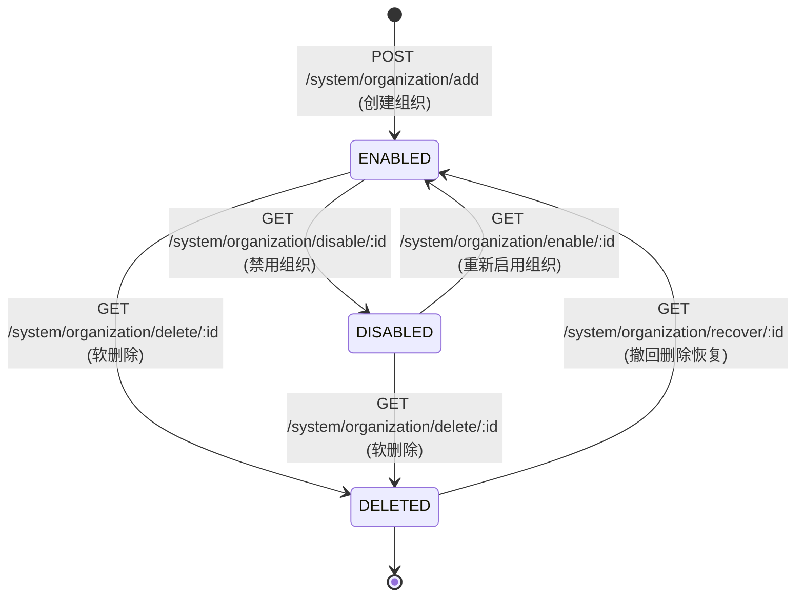

# REQ-ORG-001: 多租户组织架构管理需求规格说明

## 1. 需求背景与业务定位
在 TrueOne 质量保障体系中，“组织（Organization）”是顶层多租户隔离单元。一个租户/业务线对应一个独立组织，其内部聚合专属的项目群、环境变量、测试用例资产及成员权限。
必须保障组织数据的高可用增删改查、状态启禁用流转，以及软删除隔离。

---

## 2. 组织生命周期状态机


---

## 3. 功能接口清单与契约规格

### 3.1 组织列表查询与分页 (`POST /system/organization/list` / `/page`)
- **请求参数**：
  ```json
  {
    "current": 1,
    "pageSize": 10,
    "keyword": "可选搜索关键词"
  }
  ```
- **预期响应**：
  - 返回包装在 `data` 中的标准分页结构：`list`, `total`, `current`, `pageSize`, `totalPages`。
  - 每个组织实体包含 `id`, `name`, `description`, `enable`, `createdAt`, `updatedAt`, `memberCount`, `projectCount`。

### 3.2 创建组织 (`POST /system/organization/add`)
- **请求参数**：
  ```json
  {
    "name": "自动化测试组织-Alpha",
    "description": "专用于接口自动化验证的临时租户"
  }
  ```
- **核心逻辑**：
  - 生成毫秒级唯一 ID（如当前时间戳）。
  - 默认状态：`enable = true`, `deleted = false`。
  - 记录系统审计日志 (`ModuleSystem`, `OpTypeAdd`)。

### 3.3 修改与重命名组织 (`POST /system/organization/update` & `/rename`)
- **请求参数**：
  ```json
  {
    "id": "100001",
    "name": "新组织名称",
    "description": "新业务描述"
  }
  ```
- **预期响应**：更新 `name`, `description` 及 `updated_at` 时间戳。

### 3.4 启禁用与软删除 (`GET /system/organization/enable/:id`, `disable/:id`, `delete/:id`)
- **启禁用**：更新 `enable` 字段为 `true` 或 `false`，禁用后该组织下所有项目操作受到拦截。
- **软删除**：更新 `deleted = true`，在普通查询列表中被自动过滤（`WHERE deleted = 0`）。

---

## 4. 质量验收与安全红线 (Risk & Acceptance)
| 用例编号 | 风险等级 | 测试场景 | 验收准则 |
| :--- | :--- | :--- | :--- |
| `TC-ORG-001` | **P0** | 完整创建组织并在列表中检索 | 校验组织落库，且列表查询结果中包含对应组织名称与 ID |
| `TC-ORG-002` | **P1** | 更新组织信息与重命名 | 校验修改后信息能准确回显，`updatedAt` 发生跃迁更新 |
| `TC-ORG-003` | **P1** | 状态机流转 (禁用与重新启用) | 校验 `enable` 字段由 `true` -> `false` -> `true` 的状态流转 |
| `TC-ORG-004` | **P1** | 组织软删除隔离 | 删除后再次查询列表，该组织不再出现在有效列表清单中 |
