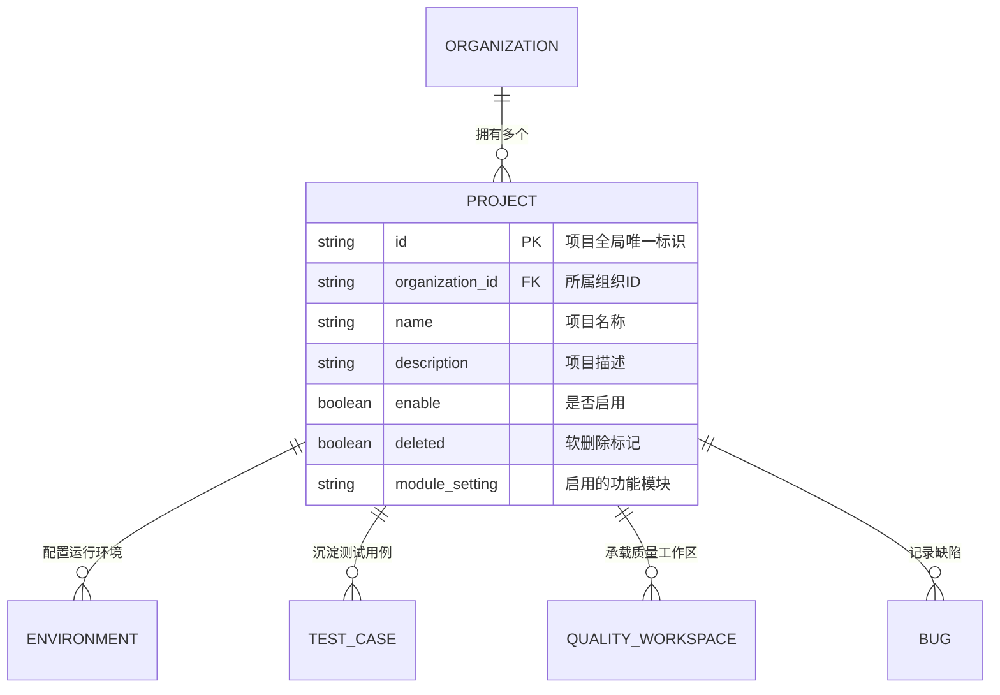

# REQ-PRJ-001: 项目生命周期与空间隔离需求规格说明

## 1. 需求背景与业务定位
“项目（Project）”是 TrueOne 平台下用例设计、执行、缺陷跟踪与质量工作流运转的核心业务载体。
每个项目从属于某个组织，并拥有独立的质量工作空间（Quality Workspace）、接口环境（Environment）、测试用例树（Module Tree）和缺陷池。必须保证项目在创建、更新、查询、归属组织过滤和软下线过程中的契约严谨性。

---

## 2. 核心架构关系与数据模型


---

## 3. 功能接口清单与契约规格

### 3.1 创建项目 (`POST /projects` / `POST /api/projects`)
- **请求参数**：
  ```json
  {
    "name": "电商结算中台质量验证项目",
    "description": "专用于测试结算链路的测试项目",
    "organizationId": "100001"
  }
  ```
- **核心逻辑**：
  - 校验 `name` 必填；
  - 若未指定 `organizationId`，则默认归属系统默认组织 `100001`；
  - 初始化默认模块配置 `["bugManagement","caseManagement","apiTest","testPlan"]`；
  - 记录审计日志 (`ModuleProject`, `OpTypeAdd`)。

### 3.2 项目详情查询 (`GET /projects/:id` / `GET /project/get/:id`)
- **预期响应**：
  - 成功：HTTP 200，返回包含 `id`, `name`, `description`, `organizationId`, `enable` 等字段的完整项目实体。
  - 失败（项目不存在或已删除）：返回错误码 404，`项目不存在`。

### 3.3 按组织筛选项目 (`GET /project/list/:orgId` / `/project/list/options/:orgId`)
- **预期响应**：
  - 返回指定组织下所有未删除的有效项目列表。

### 3.4 公开项目列表查询 (`GET /project/list` / `/project/list/public`)
- **预期响应**：
  - 返回全局可见的活跃项目简要列表。

### 3.5 更新项目信息 (`PUT /projects/:id` / `POST /project/update`)
- **请求参数**：
  ```json
  {
    "id": "100001100001",
    "name": "修改后的项目名称",
    "description": "更新后的业务描述"
  }
  ```
- **预期响应**：HTTP 200，返回 `更新成功`。

### 3.6 删除项目 (`DELETE /projects/:id`)
- **逻辑**：软删除（`deleted = 1`），更新下线时间戳，从公开与组织列表中剔除。

---

## 4. 质量验收与安全红线 (Risk & Acceptance)
| 用例编号 | 风险等级 | 测试场景 | 验收准则 |
| :--- | :--- | :--- | :--- |
| `TC-PRJ-001` | **P0** | 创建新项目并检索详情 | 创建成功并返回生成的唯一 ID，通过该 ID 检索详情字段一致 |
| `TC-PRJ-002` | **P1** | 按组织 ID 检索项目列表 | 筛选结果准确无误，所属 `organizationId` 精准对齐 |
| `TC-PRJ-003` | **P1** | 更新项目基础信息 | 名称与描述更新成功，审计日志记录变更操作 |
| `TC-PRJ-004` | **P1** | 删除项目软下线 | 删除后再次按 ID 获取详情返回 404，列表不再展示 |
